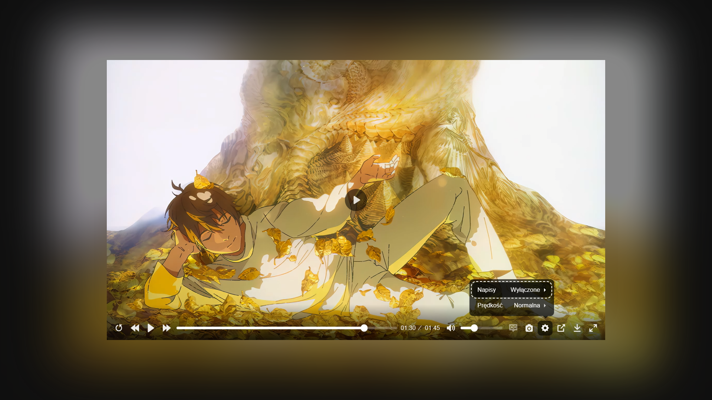

# 👀 MM_AVH WEB PLAYERS

## Multimedia Magic – Audio Visual Heaven – MKV/ASS Anime 4K Stream Online in Chromium Browsers

## ✨ DEMOs ✨

- **[plyr-video + JsSubOctopus - MKV/ASS in Chromium browsers](https://mattymroz.github.io/mm_avh_web_players/plyr-video-js-sub-oct.html)** 
- **[plyr-video-4k-60fps](https://mattymroz.github.io/mm_avh_web_players/plyr-video-4k-60fps.html)** 
- **[plyr-audio](https://mattymroz.github.io/mm_avh_web_players/plyr-audio.html)** 
- **[plyr-video-yt](https://mattymroz.github.io/mm_avh_web_players/plyr-video-yt.html)** 
- **[url-video-plyr](https://mattymroz.github.io/mm_avh_web_players/URL-Video-Player/url-video-plyr.html)** 

### 📈 Odtwarzanie plików MKV w przeglądarkach - Wyzwania i Rozwiązania

---

### 📝 OPIS

To repozytorium stanowi próbę rzetelnego zbadania problemu odtwarzania plików w formacie MKV (Matroska Video) w przeglądarkach internetowych oraz poszukiwania efektywnych rozwiązań tego wyzwania. Format MKV jest jednym z najbardziej zaawansowanych i wszechstronnych formatów wideo, oferując możliwość przechowywania różnorodnych rodzajów danych w jednym pliku, takich jak ścieżki wideo, audio, napisy i metadane.

### 📦 Zawartość repozytorium

W repozytorium znajdziesz odtwarzacz o nazwie Plyr, który został poddany eksperymentalnym modyfikacjom w celu umożliwienia odtwarzania plików w formacie MKV w przeglądarkach internetowych. Warto zaznaczyć, że nie wszystkie identyfikowane przez mnie opcje zostały w pełni zaimplementowane w tym odtwarzaczu. Obecnie odtwarzacz jest w fazie rozwoju i testów. Niemniej jednak, sens i celowość tego projektu pozostają przedmiotem dyskusji, a co za tym idzie jego kontynuowanie.

<table>
  <tr>
    <td>
      
    </td>
    <td>
      
    </td>
  </tr>
  <tr>
    <td>
      
    </td>
    <td>
      
    </td>
  </tr>
</table>

### 🤖 Wyzwanie

Przeglądarki internetowe nie są w stanie płynnie obsługiwać plików w formacie MKV. Często pojawiają się problemy związane z obsługą elementów tego formatu, takich jak strumieniowanie wideo, audio, napisów lub napisów z niestandardowymi czcionkami. Szczególnie problematyczne są napisy w formacie ASS, oferujące zaawansowane formatowanie tekstu. W przypadku, gdy plik MKV zawiera strumienie obsługiwane przez daną przeglądarkę, odtwarzanie powinno odbywać się bez zakłóceń, oczywiście zależy to od danej przeglądarki.

### 🫡 Rozwiązania

W celu przezwyciężenia tych wyzwań, repozytorium przedstawia narzędzie o nazwie "JavascriptSubtitlesOctopus." To narzędzie wprowadza usprawnienia w renderowaniu napisów w formacie ASS w przeglądarkach internetowych. Warto jednak pamiętać, że działanie "JavascriptSubtitlesOctopus" może być zróżnicowane w zależności od używanej przeglądarki, szczególnie jeśli nie opiera się na silniku Chromium.

Dla uzyskania optymalnej jakości i kontroli nad napisami w filmach w formacie MKV, rekomendowane jest korzystanie z zaawansowanych odtwarzaczy takich jak VLC lub MPV. Odtwarzacze te posiadają funkcje strumieniowania, pozwalając na bezstratne odtwarzanie treści z serwera oraz pełną manipulację napisami. Dodatkowo, VLC i MPV są dostępne na różnych platformach, umożliwiając swobodny dostęp do zawartości w formacie MKV.

### ⚠️ Uwagi:

Należy mieć na uwadze, że zarówno wypalanie napisów, jak i konwersja plików mkv do innych formatów wideo, wiążą się z pewnymi problemami. Te procesy są czasochłonne i mogą prowadzić do obniżenia jakości treści lub znacznego zwiększenia rozmiaru pliku wynikowego. :(

Krótka odpowiedź jest taka, że przeglądarki nie obsługują MKV dla wideo HTML5.

Nieco dłuższą odpowiedzią jest to, że czasami możesz uzyskać niektóre MKV do odtwarzania w przeglądarkach obsługujących webm, ponieważ webm jest podzbiorem MKV. Ale nawet wtedy żadna przeglądarka nie obsługuje kodeka audio AC3, czy też innych audio/video powszechnie używanego w MKV, więc możesz nie uzyskać dźwięku albo obrazu.

### Śmieszne linki:

https://github.com/sampotts/plyr 
https://github.com/zengde/plyr-plugin-capture 
https://github.com/zengde/plyr-plugin-thumbnail 
https://github.com/zengde/plyr-vr 
https://github.com/zengde/plyr-thumbnail-generate 
 
https://github.com/video-dev/hls.js 
https://github.com/videojs/video.js 
https://github.com/videojs/http-streaming 
 
https://github.com/XI11A/URL-Video-Player 
https://huggingface.co/ 
 
https://github.com/libass/JavascriptSubtitlesOctopus 
https://github.com/libass/libass 
https://mkv-player.netlify.app/ 
 
https://mpv.io/ 
https://github.com/videolan/vlc 
https://github.com/videolan 
 
https://github.com/MattyMroz/mm_avh_media_players 
https://github.com/qgustavor/direct-mega/issues/5 
https://github.com/qgustavor/ffmpeg.js 

Używaj tego kodu tylko wtedy, gdy dokładnie wiesz, co on robi. Nie ponoszę żadnej odpowiedzialności za sposób, w jaki używasz tego kodu, ani za jakiekolwiek błędy, które mogą występować w kodzie. Szczerze mówiąc, nie powinieneś ufać żadnemu kodowi, który piszę – sam tego nie robię.
